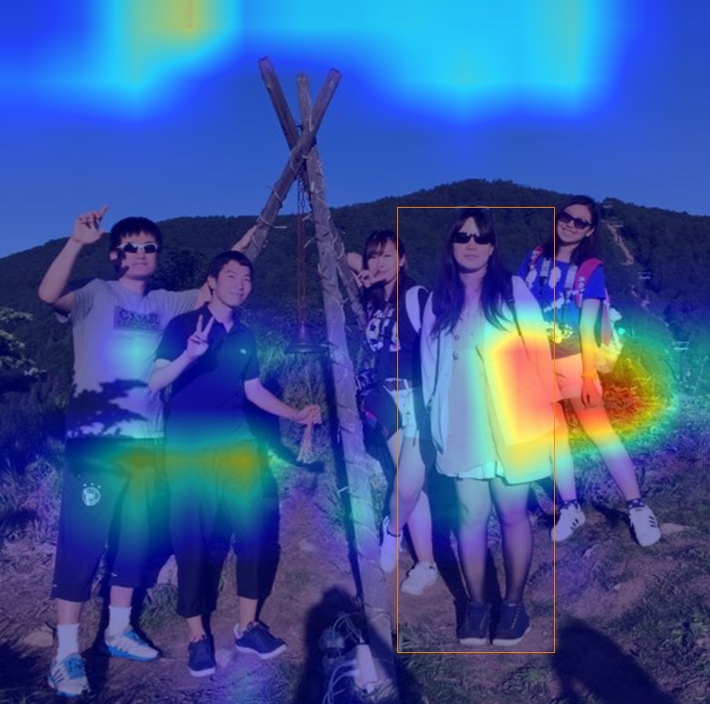

# YOLOv2
https://github.com/leetenki/YOLOv2

使用した元のchnainer版 YOLOv2

## 確認環境
- windows 7 64bit
- Anaconda 4.0.0
- Python 2.7
- OpenCV 2.X
- Chainer 1.16.0

## YOLOv2のgrad-cam検討
Grad-camによる可視化のための変更をかけています

grad-camの論文はこちら

https://arxiv.org/abs/1610.02391

論文のオリジナル実装（Lua）：https://github.com/ramprs/grad-cam

Keras：https://github.com/jacobgil/keras-grad-cam

Chainer：https://github.com/tsurumeso/chainer-grad-cam
