# YOLOv2
https://github.com/leetenki/YOLOv2

使用した元のchnainer版 YOLOv2

## 確認環境
- windows 7 64bit
- Anaconda 4.0.0
- Python 2.7
- OpenCV 2.X
- Chainer 1.16.0

## YOLOv2のgrad-cam検討
Grad-camによる可視化のための変更をかけています

これで動いてるのでしょうか？？

問題点
- 論文のImgeNetのようなクラス分類でないこと
- BBOXのbackpropagationをどうするのか（x,y,w,h）のLoss
- おそらく画面関係が対応しない20層以降
- 入力画像サイズで反応が違う（原因不明）

添付写真は18層の反応を女の人から作ったもの

 

以降22層から全部ならべてみた

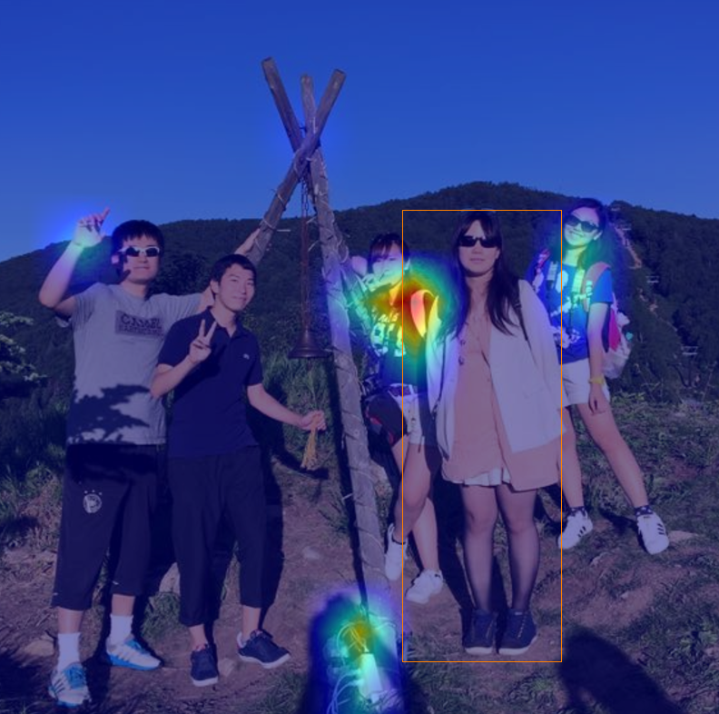
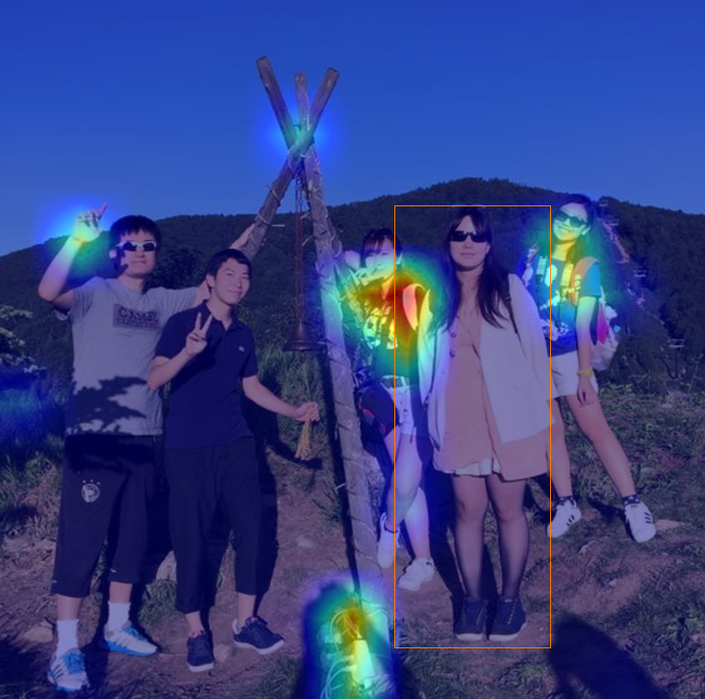
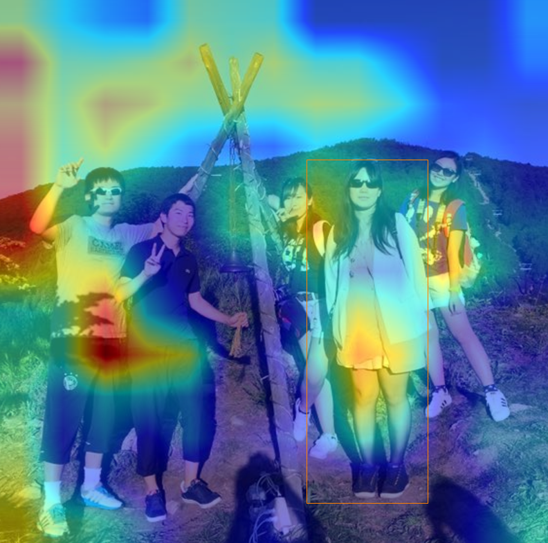

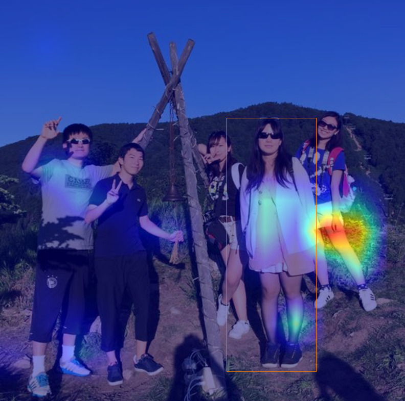

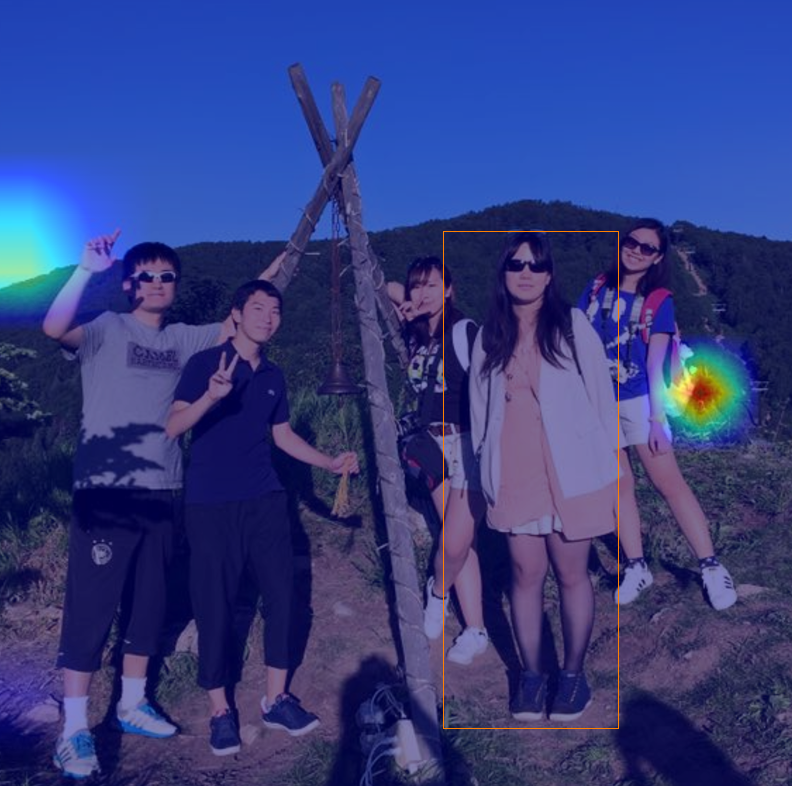
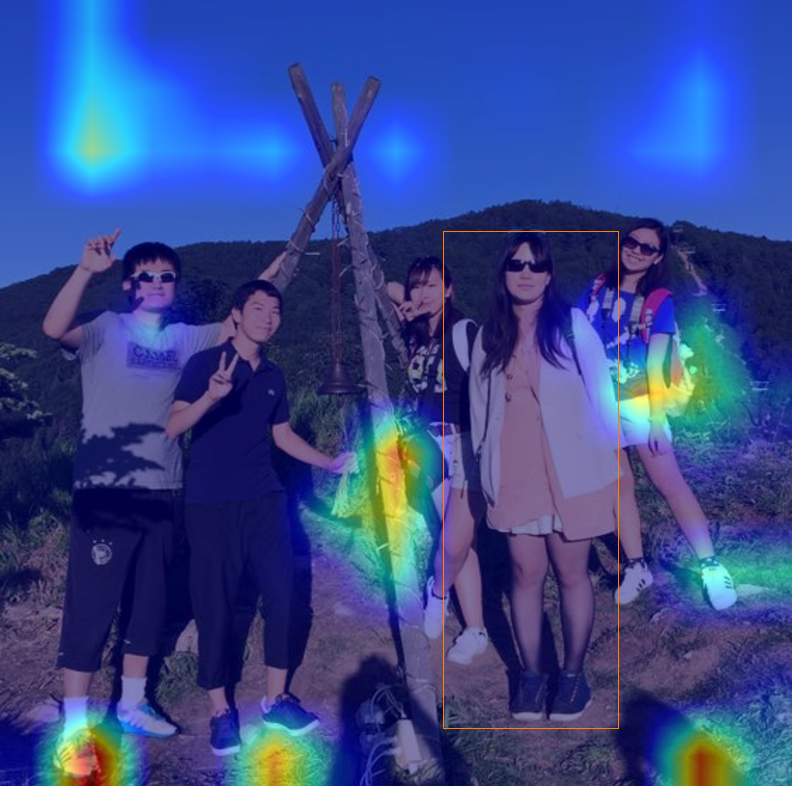

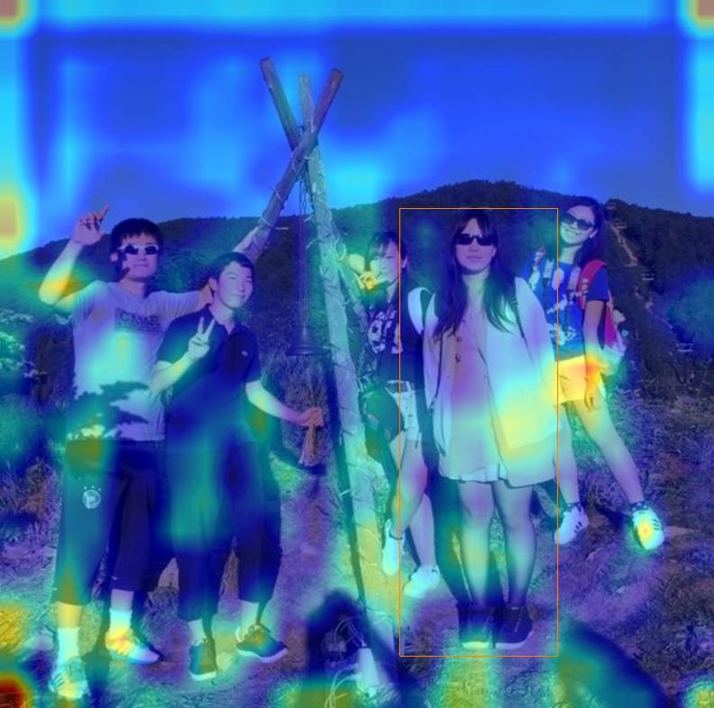
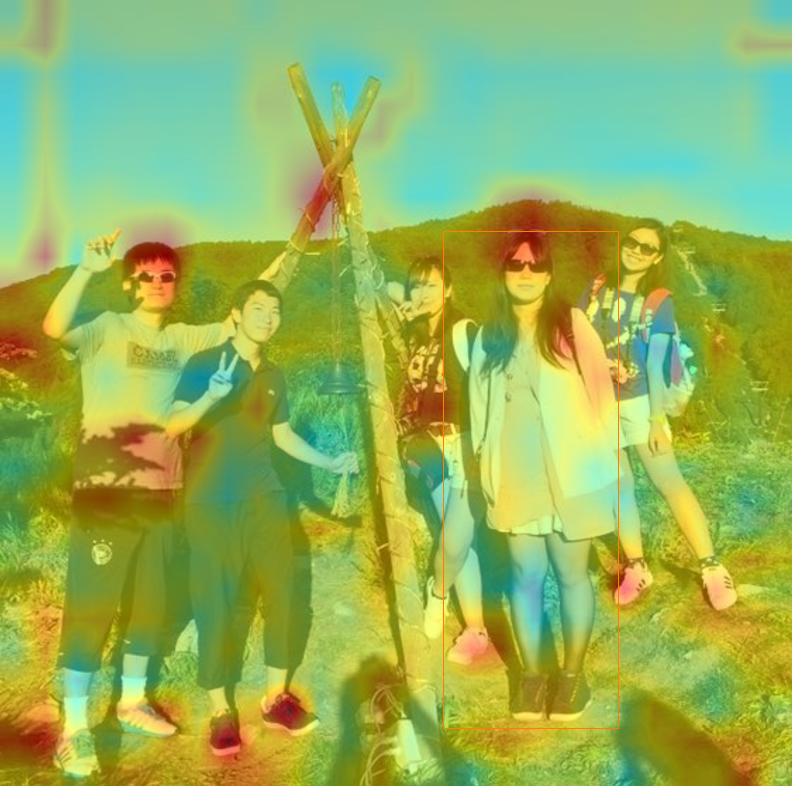

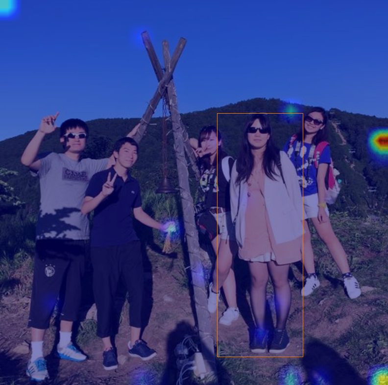
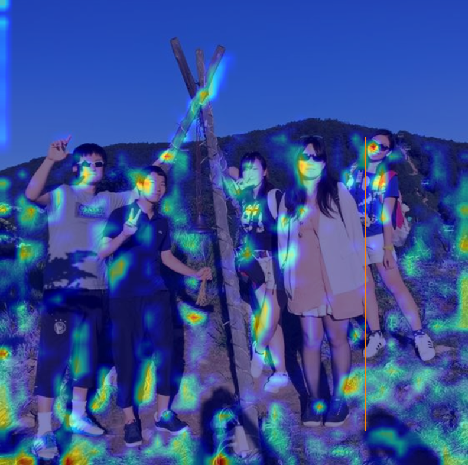
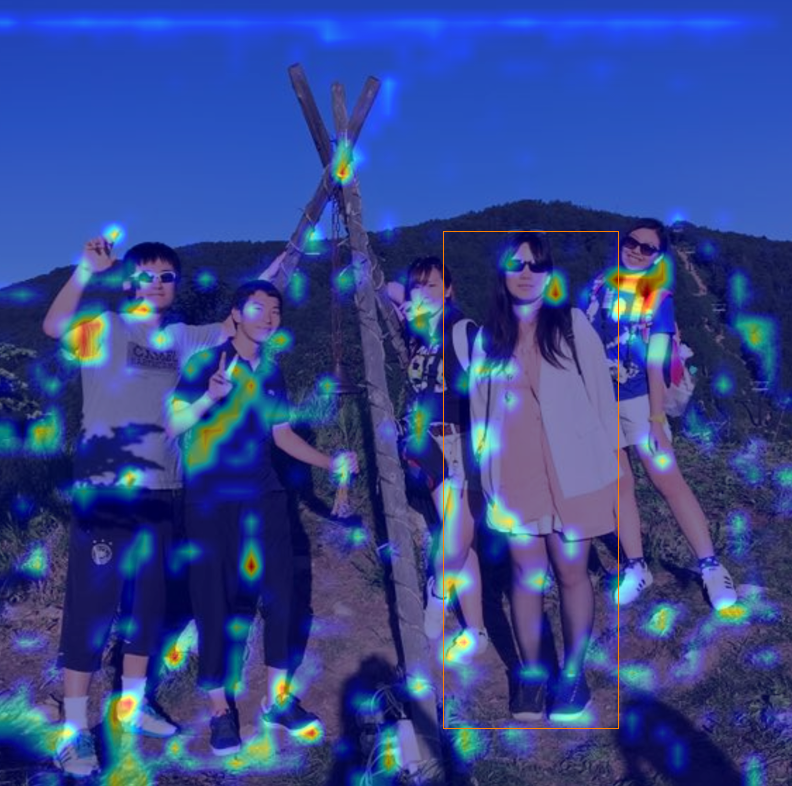

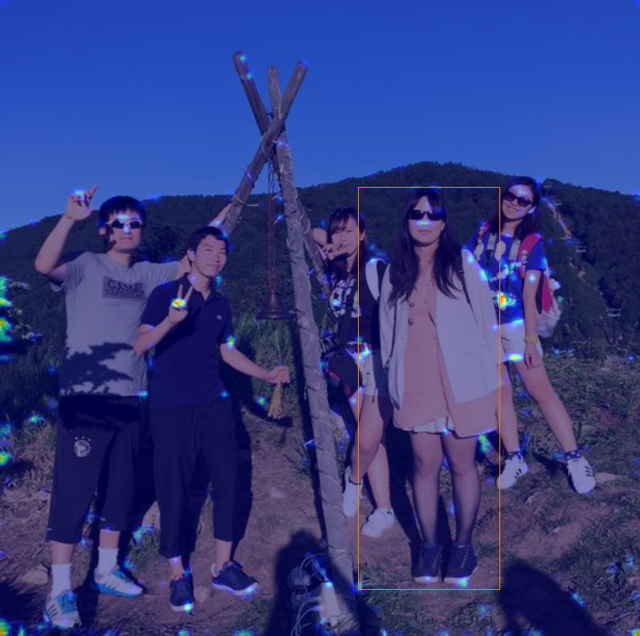

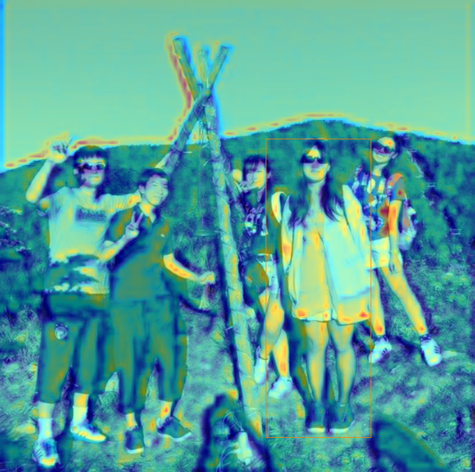

grad-camの論文はこちら

https://arxiv.org/abs/1610.02391

論文のオリジナル実装（Lua）：https://github.com/ramprs/grad-cam

Keras：https://github.com/jacobgil/keras-grad-cam

Chainer：https://github.com/tsurumeso/chainer-grad-cam
